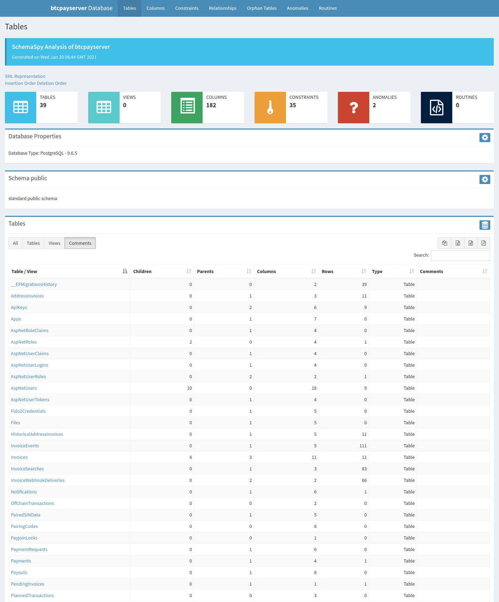

# DB Documentation Generator for BTCPay Server
This tool allows you to generate interactive documentation for BTCPay Server's database by using [SchemaSpy](https://github.com/schemaspy/schemaspy).

## Requirements
- A running database to analyse (settings are in `schemaspy.properties`)
- Docker

## How to generate?
1. Start a local development setup of BTCPay Server (typically `docker-compose up dev`)
2. Run the shell script `generate.sh`
3. The output will be generated in `/output`

## How to view?
- Navigate to `/output/index.html` with your browser.

## Notes
- This script generates output with SVG images. If you prefer PNG, you can change `schemaspy.properties` to do so.
- A full DB drawing is available at `/output/diagrams/summary/relationships.real.large.svg`

## Screenshots
Some screenshots of the output you'll get.
### Tables

### Columns

### Constraints

### Relationships

### Utility

### Anomalies

### Routines
